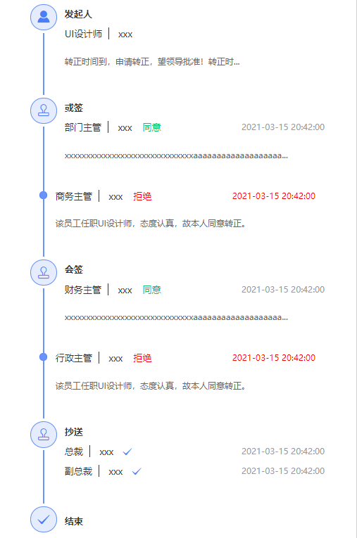

## vue-approval-progress(当前版本 V1.0.1)

一款高效、简洁、功能丰富的审批进度流程显示 pc 端插件

## 兼容版本

Vue2.x

## Install

```javascript
	npm i vue-approval-progress -S

	//main.js
	import vap from "vue-approval-progress";
	Vue.use(vap)

```

## 示例

```javascript
	<vue-approval-progress :data-list="dataList"></vue-approval-progress>

	data:(){
		dataList:[
        [
          {
            title: "发起人",
            icon: "vapfont vap-top_icon4",
            headportrait: [
              "https://v3.cn.vuejs.org/logos.png",
              "https://v3.cn.vuejs.org/logos.png",
            ],
            iconLabel: "发",
            handlerInfo: [
              {
                name: "xxx",
                post: "UI设计师",
                approvalType: "",
              },
            ],
            desc:
              "转正时间到，申请转正，望领导批准！转正时间到，申请转正，望领导批准！转正时间到，申请转正，望领导批准！",
          },
        ],
        [
          {
            title: "或签",
            headportrait: ["https://v3.cn.vuejs.org/logos.png"],
            handlerInfo: [
              {
                name: "xxx",
                post: "部门主管",
                time: "2021-03-15  20:42:00",
                approvalType: "同意",
              },
            ],
            desc:
              "xxxxxxxxxxxxxxxxxxxxxxxxxxxxxxaaaaaaaaaaaaaaaaaaabbbbbbbbbbbbbbbbbbbbbbbccccccccccccccccccccdddddddddddddddddd",
          },
          {
            title: "",
            handlerInfo: [
              {
                name: "xxx",
                post: "商务主管",
                time: "2021-03-15  20:42:00",
                approvalType: "拒绝",
                approvalTypeColor: "red",
                timeColor: "red",
                stepList: "red",
              },
            ],
            desc: "该员工任职UI设计师，态度认真，故本人同意转正。",
          },
        ],
        [
          {
            title: "会签",
            headportrait: ["https://v3.cn.vuejs.org/logos.png"],
            handlerInfo: [
              {
                name: "xxx",
                post: "财务主管",
                time: "2021-03-15  20:42:00",
                approvalType: "同意",
              },
            ],
            desc: "",
          },
          {
            title: "",
            handlerInfo: [
              {
                name: "xxx",
                post: "行政主管",
                time: "2021-03-15  20:42:00",
                approvalType: "拒绝",
                approvalTypeColor: "red",
                timeColor: "red",
                stepList: "red",
              },
            ],
            desc: "该员工任职UI设计师，态度认真，故本人同意转正。",
            mark: "第2次审批",
            markColor:"red"
          },
        ],
        [
          {
            title: "抄送",
            handlerInfo: [
              {
                name: "xxx",
                post: "总裁",
                time: "2021-03-15  20:42:00",
                approvalType: "",
                icon: "vapfont vap-gou",
              },
              {
                name: "xxx",
                post: "副总裁",
                time: "2021-03-15  20:42:00",
                approvalType: "抄送",
                icon: "vapfont vap-gou",
              },
            ],
            desc: "",
          },
        ],
      ]
	}

```

## ui 效果图



## Attribute

| 属性         | 类型                  | 说明                     | 默认(默认值) | 是否必传 |
| ------------ | --------------------- | ------------------------ | ------------ | -------- |
| data-list    | Array（**二维数组**） | 流程数据源(下方详细说明) | true([])     | FALSE    |
| max-row      | Number                | 文字超过多少行显示省略号 | true(2)      | FALSE    |
| over-visible | Boolean               | 数据默认添加结束项       | true(true)   | FALSE    |

## data-list

| 属性        | 类型   | 说明                                                                                                         | 是否默认 | 默认值                                             |
| ----------- | ------ | ------------------------------------------------------------------------------------------------------------ | -------- | -------------------------------------------------- |
| title       | String | 当条数据的 title（注意有多个处理人的情况不展示，参考'或签/会签'样式）                                        |          |                                                    |
| desc        | String | 当条数据的文字说明展示                                                                                       |          |
| mark        | String | 当存在 mark 值时，会显示额外的提示信息，如图"第二次审批"                                                     |          |
| markColor   | String | mark 字体颜色                                                                                                | true     | #FFAE3C                                            |
| icon        | String | 当条数据的图标展示（注意有多个处理人的情况不展示，参考'或签/会签'样式），若存在 iconLabel 则不展示 icon 图标 | true     | 第一条数据默认人头，结尾数据默认打勾，其它默认印章 |
| iconLabel   | String | 当条数据的图标替换成文字（注意有多个处理人的情况不展示，参考'或签/会签'样式；注意传此则不展示 icon）         |          |
| handlerInfo | Array  | 当条数据的处理人信息，可传多条(下方详细说明)                                                                 |          |                                                    |

## handlerInfo

| 属性              | 类型   | 说明                     | 是否默认 | 默认值  |
| ----------------- | ------ | ------------------------ | -------- | ------- |
| name              | String | 处理人文字说明           |          |         |
| post              | String | 处理人职务               |          |         |
| time              | String | 处理时间                 |          |         |
| timeColor         | String | 处理时间文字颜色         | true     | #999999 |
| approvalType      | String | 处理状态文字说明         |          |
| approvalTypeColor | String | 处理状态文字颜色         | true     | #07c264 |
| icon              | String | 处理人后面跟的 icon 图标 |          |         |

## API

| 函数名 | 说明     | 参数格式 | 调用示例               |
| ------ | -------- | -------- | ---------------------- |
| init   | 手动更新 |          | this.$refs.vap.init(); |

## Other

1、后继会继续更新 vue3 版本

2、如果有其他问题邮件沟通1195669615@qq.com或者加 qq1195669615。若插件能够帮助到您，期待您的 star 哦！

3、欢迎加入 qq 交流群（目前正在起步中）


