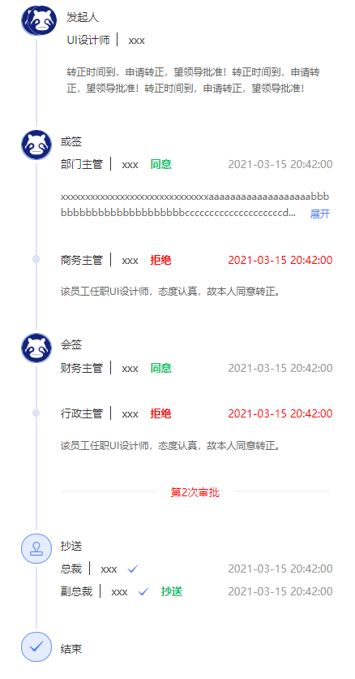
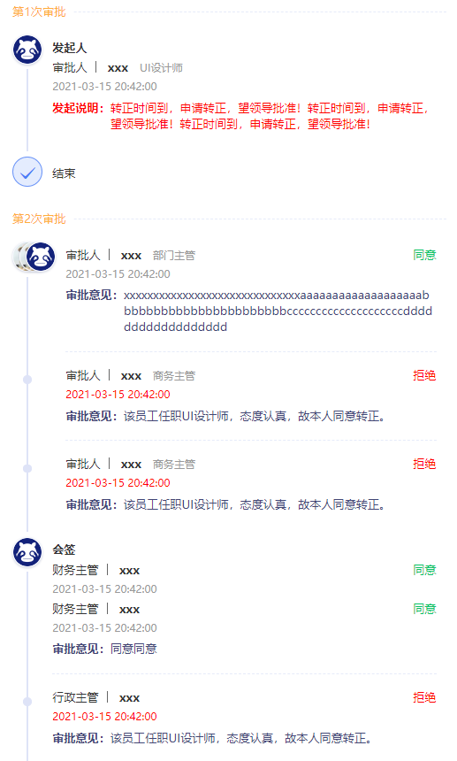

## vue-approval-progress(当前版本 V2.0.0)

一款高效、简洁、功能丰富的审批进度流程显示 pc 端插件

## 兼容版本

Vue2.x

## Install

```javascript
	npm i vue-approval-progress -S

	//main.js
	import vap from "vue-approval-progress";
	Vue.use(vap)

```

## 示例

```javascript
	<vue-approval-progress :data-list="dataList"></vue-approval-progress>

	data() {
    return {
      dataList: [
        {
          title: "x",
          list: [
            [
              {
                title: "发起人",
                icon: "vapfont vap-top_icon4",
                headportrait: ["https://v3.cn.vuejs.org/logos.png"],
                iconLabel: "发",
                handlerInfo: [
                  {
                    name: "xxx",
                    prefix: "审批人",
                    post: "UI设计师",
                    time: "2021-03-15  20:42:00",
                    approvalType: "",
                  },
                ],
                descPrefixColor:"red",
                descColor:"red",
                descPrefix:"发起说明",
                desc:
                  "转正时间到，申请转正，望领导批准！转正时间到，申请转正，望领导批准！转正时间到，申请转正，望领导批准！",
              },
            ],
          ],
        },
        {
          title: "",
          list: [
            [
              {
                title: "",
                headportrait: [
                  "http://wework.qpic.cn/bizmail/yEeLOMJgibZwIUJQXyfdyAaLFIgVjFUzl78HdIJ2eFelFk3hMroghMQ/100",
                  // "http://wework.qpic.cn/bizmail/wM9IumlQibQ6o3epyIZGh3P0VriargcE46pBYL82GqiauxJvF6TbQAgHw/100",
                  // null,
                ],
                handlerInfo: [
                  {
                    name: "xxx",
                    prefix: "审批人",
                    post: "部门主管",
                    time: "2021-03-15  20:42:00",
                    approvalType: "同意",
                  },
                ],
                descPrefix:"审批意见",
                desc:
                  "xxxxxxxxxxxxxxxxxxxxxxxxxxxxxxaaaaaaaaaaaaaaaaaaabbbbbbbbbbbbbbbbbbbbbbbccccccccccccccccccccdddddddddddddddddd",
              },
              {
                title: "",
                headportrait: [
                  "http://wework.qpic.cn/bizmail/yEeLOMJgibZwIUJQXyfdyAaLFIgVjFUzl78HdIJ2eFelFk3hMroghMQ/100",
                ],
                handlerInfo: [
                  {
                    name: "xxx",
                    prefix: "审批人",
                    post: "商务主管",
                    time: "2021-03-15  20:42:00",
                    approvalType: "拒绝",
                    approvalTypeColor: "red",
                    timeColor: "red",
                    stepList: "red",
                  },
                ],
                descPrefix:"审批意见",
                desc: "该员工任职UI设计师，态度认真，故本人同意转正。",
              },
              {
                title: "",
                headportrait: ["https://v3.cn.vuejs.org/logos.png"],
                handlerInfo: [
                  {
                    name: "xxx",
                    prefix: "审批人",
                    post: "商务主管",
                    time: "2021-03-15  20:42:00",
                    approvalType: "拒绝",
                    approvalTypeColor: "red",
                    timeColor: "red",
                    stepList: "red",
                  },
                ],
                descPrefix:"审批意见",
                desc: "该员工任职UI设计师，态度认真，故本人同意转正。",
              },
            ],
            [
              {
                title: "会签",
                headportrait: ["https://v3.cn.vuejs.org/logos.png"],
                handlerInfo: [
                  {
                    name: "xxx",
                    prefix: "财务主管",
                    time: "2021-03-15  20:42:00",
                    approvalType: "同意",
                  },
                  {
                    name: "xxx",
                    prefix: "财务主管",
                    time: "2021-03-15  20:42:00",
                    approvalType: "同意",
                  },
                ],
                descPrefix:"审批意见",
                desc: "同意同意",
              },
              {
                title: "",
                handlerInfo: [
                  {
                    name: "xxx",
                    prefix: "行政主管",
                    time: "2021-03-15  20:42:00",
                    approvalType: "拒绝",
                    approvalTypeColor: "red",
                    timeColor: "red",
                    stepList: "red",
                  },
                ],
                descPrefix:"审批意见",
                desc: "该员工任职UI设计师，态度认真，故本人同意转正。",
                mark: "第2次审批",
                markColor: "red",
              },
            ],
            [
              {
                title: "抄送人",
                sameLineTime:true,
                // icon: "vapfont vap-gou2",
                // headportrait: ["https://v3.cn.vuejs.org/logos.png","https://v3.cn.vuejs.org/logos.png","https://v3.cn.vuejs.org/logos.png"],
                handlerInfo: [
                  {
                    name: "xxx",
                    post: "总裁",
                    // prefix: "总裁",
                    time: "2021-03-15  20:42:00",
                    // approvalType: "",
                    // icon: "vapfont vap-gou2",
                  },
                  {
                    name: "xxx",
                    post: "副总裁",
                    // prefix: "副总裁",
                    time: "2021-03-15  20:42:00",
                    // approvalType: "抄送",
                    // icon: "vapfont vap-gou",
                  },
                ],
                descPrefix:"审批意见",
                desc: "",
              },
            ],
          ],
        },
      ],
    };
  }

```

## V1.x 版本 ui 效果图(请使用 1.1.0)



## V2.x 版本 ui 效果图



## Attribute

| 属性         | 类型    | 说明                     | 默认(默认值) | 是否必传 |
| ------------ | ------- | ------------------------ | ------------ | -------- |
| data-list    | Array   | 流程数据源(下方详细说明) | true([])     | FALSE    |
| max-row      | Number  | 文字超过多少行显示省略号 | true(5)      | FALSE    |
| over-visible | Boolean | 数据默认添加结束项       | true(true)   | FALSE    |

## data-list

| 属性  | 类型               | 说明                               | 是否默认 | 默认值 |
| ----- | ------------------ | ---------------------------------- | -------- | ------ |
| title | String             | 当前流程的 title，如图"第一次审批" |          |        |
| list  | Array （二维数组） | 当前流程数据源(下方详细说明)       |          |

## list

| 属性            | 类型   | 说明                                                                                                         | 是否默认 | 默认值                                             |
| --------------- | ------ | ------------------------------------------------------------------------------------------------------------ | -------- | -------------------------------------------------- |
| title           | String | 当条数据的 title（注意有多个处理人的情况不展示，参考'或签/会签'样式）                                        |          |                                                    |
| sameLineTime    | String | 当条数据的时间是否和用户信息展示在同一行                                                                     |          |                                                    |
| descPrefix      | String | 当条数据的文字说明前缀                                                                                       | true     | 备注说明                                           |
| descPrefixColor | String | 当条数据的文字说明前缀字体颜色                                                                               | true     | #424675                                            |
| desc            | String | 当条数据的文字说明展示                                                                                       |          |
| descColor       | String | 当条数据的文字说明字体颜色                                                                                   | true     | #424675                                            |
| headportrait    | Array  | 头像显示，当存在 headportrait 值时，会优先于 label 和 icon 的显示                                            |          |                                                    |
| icon            | String | 当条数据的图标展示（注意有多个处理人的情况不展示，参考'或签/会签'样式），若存在 iconLabel 则不展示 icon 图标 | true     | 第一条数据默认人头，结尾数据默认打勾，其它默认印章 |
| iconLabel       | String | 当条数据的图标替换成文字（注意有多个处理人的情况不展示，参考'或签/会签'样式；注意传此则不展示 icon）         |          |
| handlerInfo     | Array  | 当条数据的处理人信息，可传多条(下方详细说明)                                                                 |          |                                                    |

## handlerInfo

| 属性              | 类型   | 说明                     | 是否默认 | 默认值  |
| ----------------- | ------ | ------------------------ | -------- | ------- |
| prefix            | String | 处理人文字前缀           |          |         |
| name              | String | 处理人文字说明           |          |         |
| post              | String | 处理人职务               |          |         |
| time              | String | 处理时间                 |          |         |
| timeColor         | String | 处理时间文字颜色         | true     | #999999 |
| approvalType      | String | 处理状态文字说明         |          |
| approvalTypeColor | String | 处理状态文字颜色         | true     | #07c264 |
| icon              | String | 处理人后面跟的 icon 图标 |          |         |

## API

| 函数名 | 说明     | 参数格式 | 调用示例               |
| ------ | -------- | -------- | ---------------------- |
| init   | 手动更新 |          | this.$refs.vap.init(); |

## Other

1、后继会继续更新 vue3 版本

2、如果有其他问题邮件沟通1195669615@qq.com或者加 qq1195669615。若插件能够帮助到您，期待您的 star 哦！

3、欢迎加入 qq 交流群（目前正在起步中）


